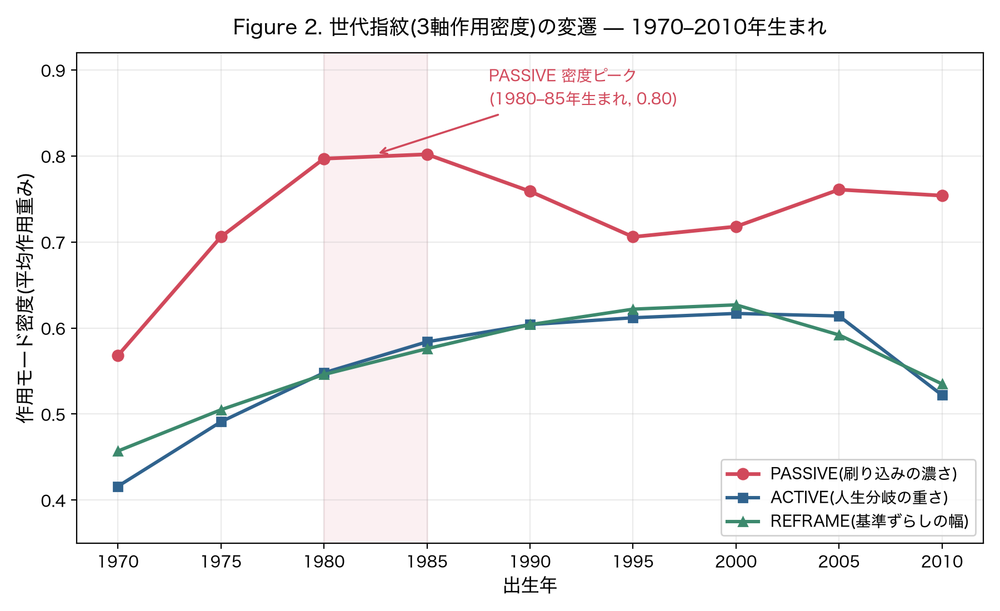
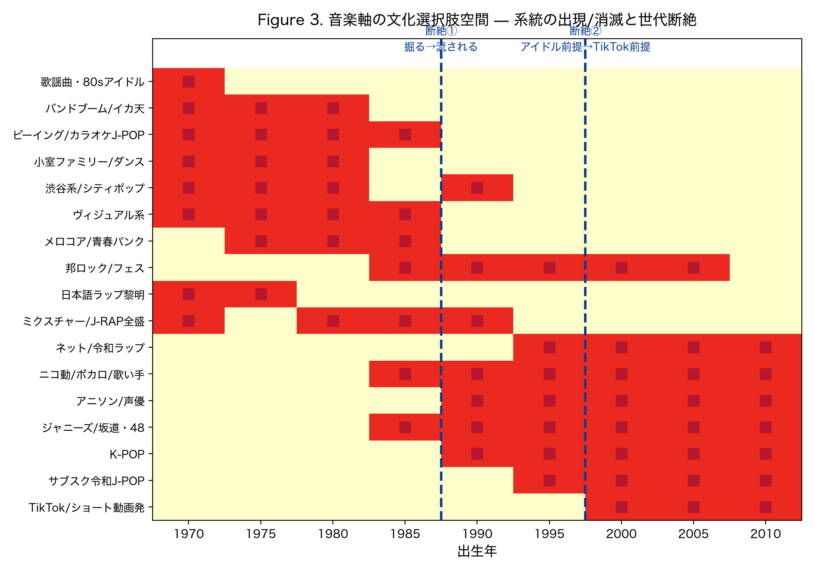

# SCEM — Situated Cohort Exposure Model

[](https://doi.org/10.5281/zenodo.20827897)
[](LICENSE)

**社会事象の作用ベクトルが、ライフステージの感受性窓にどう着弾したか**から「世代」を計算するモデル。

> **中心的主張:** 世代とは出生年コホートではなく、**社会事象の作用ベクトルが認知発達上の感受性窓(life-stage sensitivity windows)にどう着弾したかで決まる連続プロファイル**である。

マーケティングの「Z世代論」が抱える三つの欠陥——恣意的なカットオフ・反証不能性・出生年への単一還元——を、計算可能で反証可能なモデルで置き換える。Mannheim (1928) の定性的世代論を計算可能にし、Strauss & Howe (1991) の恣意的カットオフを連続関数に置き換える。

- 📄 論文(preprint draft, 日本語): [`docs/paper1_media_generation.md`](docs/paper1_media_generation.md)
- 🏛 正典アーキテクチャ(v6 FIXED): [`ARCHITECTURE.md`](ARCHITECTURE.md)

---

## モデル構造(3層 + 意図的スコープ)

| 層 | 役割 | 実装 |
|---|---|---|
| **構造層** | 事象 × 着弾年齢 × 作用モードのテンソル。世代指紋(3軸)・干渉・REFRAME発火を計算 | `media_generation_v4.py` / `v5.py` / `event_loader.py` |
| **Community層** | 環境による曝露変調。閉鎖度(離散アーキタイプ)× 伝播速度(連続offset) | `community_experiment.py` |
| **Culture層** | 嗜好分岐の仮説生成器(マーケ応用) | `culture_axis.py` / `generate_picks.py` |

**3作用モード**(生の合計で同列にしない、3軸として保持):

- **PASSIVE**(受動着弾):身体・原風景への刷り込み。質感・懐かしさ・「当たり前」感。
- **ACTIVE**(能動分岐):意思決定を強制する作用。人生分岐の傷や癖。
- **REFRAME**(参照点書き換え):基準値を書き換え、後続事象との差分で発火する隠れた物差し。

**設計の要点:** イベントを単一カテゴリに潰さない(domainは表示タグ、計算には作用ベクトルのコサインのみを使う)。これは「出生年という離散バケツを拒む」という中心的主張の、イベント側への自己適用である。

**スコープ外(意図的境界):** 個人層(self-efficacy)/ 個人の情報–具現化ラグ / 地域間波及ダイナミクス。SCEM は**集団の曝露構造**を対象とする。

---

## 主要な結果

- **1981年生まれの世代指紋**: PASSIVE **0.81** / ACTIVE 0.56 / REFRAME 0.55(PASSIVE突出)。人格形成期(14–15歳)に「安全神話の崩壊 × 掘って楽しむ消費文化」が同時着弾し、翌年 PlayStation と Windows95 が二重着弾。
- **9世代バッチ(1970–2010)**: PASSIVE 密度は **1980–85年生まれでピーク(0.80)** を取り以降減衰、ACTIVE/REFRAME は単調上昇し2000年前後で接近(3軸の均衡化)。
- **文化選択肢空間の断絶**: 1985→1990(「掘る文化→流される文化」)、1995→2000(「アイドル前提→TikTok前提」)。





---

## クイックスタート

```bash
# 構造層(エンジン)は標準ライブラリのみで動く
python3 src/media_generation_v5.py 1981       # 1981年生まれの3軸プロファイル

# 9世代バッチ
PYTHONPATH=src python3 -c "import media_generation_v5 as v5; v5.batch_compare([1970,1975,1980,1985,1990,1995,2000,2005,2010], v5.load_events())"

# 図の生成(matplotlib が必要)→ figures/ に出力
python3 src/make_figures.py

# Culture層・Community層(LLM)は OpenAI API キーが必要
cp .env.example .env   # 各自のキーを記入(.env は .gitignore 済み)
python3 src/generate_picks.py --batch
python3 src/community_experiment.py
```

依存(LLM層・図のみ): [`requirements.txt`](requirements.txt) を参照(`openai`, `python-dotenv`, `matplotlib`)。

---

## リポジトリ構成

```
README.md  ARCHITECTURE.md  requirements.txt  .env.example

src/
  media_generation_v4.py   構造層 計算コア(感受性カーブ/3モード/干渉/REFRAME/被り判定)
  media_generation_v5.py   データ接続・3軸レポート・多世代バッチ
  event_loader.py          156件DB ローダー
  culture_axis.py          Culture層(構造×文化サブクラスタ)
  generate_picks.py        世代別pickリスト生成
  compare_picks.py         pickリスト世代比較
  culture_interactive.py   対話的Culture探索
  community_experiment.py  Community層 例示(閉鎖度×伝播速度の分岐ペルソナ)
  test_domainless.py       domain冗長性の実測(domain廃止を正当化)
  test_lag.py              情報–具現化ラグの味見
  make_figures.py          Figure 2 / 3 生成(→ figures/)
  build_html.py            docs/paper.md → 印刷用HTML(→PDF)

data/    events_patched.jsonl   社会事象DB(日本, 156件, 出典URL付き)
docs/    paper1_media_generation.md  preprint 本文(全7章 + 付録A–D)
figures/ fig2_cohort_fingerprint.png  fig3_music_disruption.png
cache/   picks_cache/(9世代)  community_experiment_cache.json(Appendix D)
```

---

## ステータス

**Preprint v1**(タイムスタンプ確保目的)。本リポジトリは構造層 + Culture層(仮説生成器)を収録。

**Paper 2 ロードマップ:**
- Prolific パネルによる実証(プロファイル一致率・断絶境界・干渉特異性)
- **3C フレームワーク**: Culture / Community / **Code**(=共同体の「許可・禁止・黙認・推奨」の規範コード。プログラミング技能ではない)
- **Contextual Mode Resolver**: 同一事象でも宗教・階層・地域規範・地政学的位置で作用モードが変わる。`Event.mode` を固定値でなく `Event × Community × Code → ResolvedImpact` として解決(海外版 SCEM の本丸)

---

## 著者・引用

Masamichi Iizumi, Tamaki Iizumi (Miosync, Inc.)

```bibtex
@software{iizumi2026scem,
  title     = {Situated Cohort Exposure Model (SCEM): Reconstructing Generations
               from Social Event Impact Vectors and Life-Stage Sensitivity Windows},
  author    = {Iizumi, Masamichi and Iizumi, Tamaki},
  year      = {2026},
  publisher = {Zenodo},
  version   = {1.0.0},
  doi       = {10.5281/zenodo.20827897},
  url       = {https://doi.org/10.5281/zenodo.20827897},
  note      = {Concept DOI (all versions); v1.0.0 = 10.5281/zenodo.20827898}
}
```

© 2026 Masamichi Iizumi, Tamaki Iizumi (Miosync, Inc.). License: [MIT](LICENSE).
