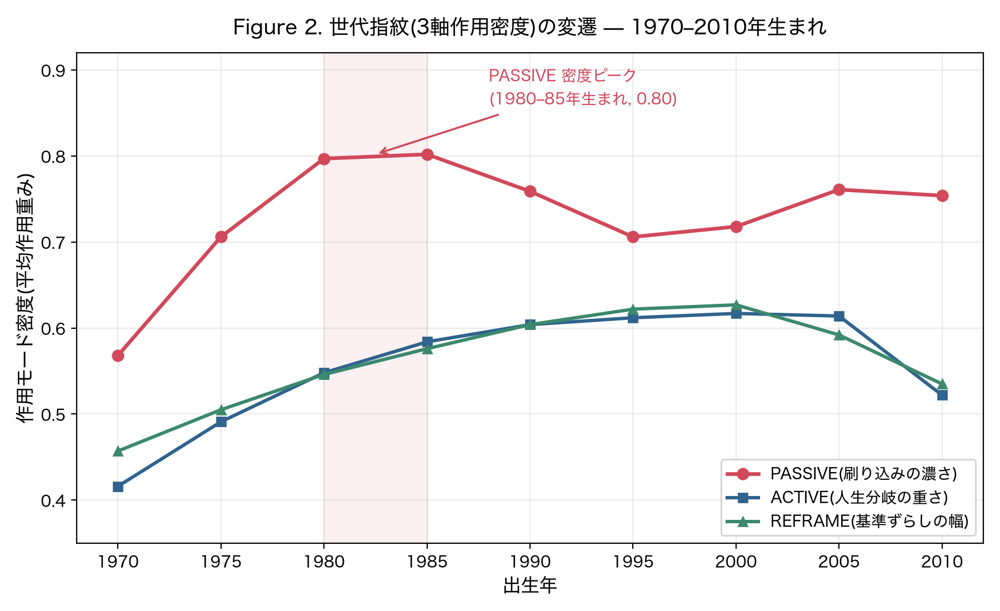
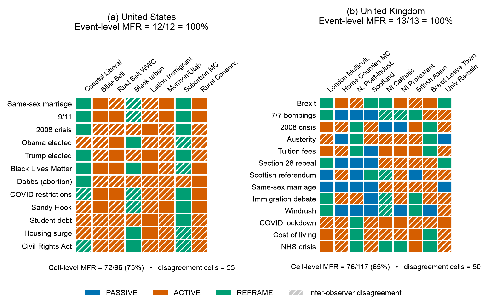

# SCEM — Situated Cohort Exposure Model

[](https://doi.org/10.5281/zenodo.20827897)
[](LICENSE)

**A computational framework that treats "a generation" as an exposure structure rather than a birth-year bucket, and models how the same social event resolves into a different action mode for each community.**

SCEM has **two faces**, both standing on the same engine (Core / CMR):

- 🎓 **Academic framework** (↓ Track A) — a research base that redefines generations as computable and falsifiable, externally cross-checked against GSS/ESS.
- 🎭 **Persona-generation engine** (↓ Track B) — an implementation that generates personas **traceable back to** the exposure structure, from birth year × community premise.

> **Two core claims:**
> 1. **A generation is not a birth-year cohort.** It is a continuous profile determined by how the action vectors of social events land on the **sensitivity windows** of cognitive development.
> 2. **An action mode is not intrinsic to an event.** It is resolved by the community's premise —— `Event × Premise → ResolvedImpact` (Contextual Mode Resolver).

---

## Shared engine (layered structure)

`src/` maps physically onto this layered structure. Both tracks share this engine.

| Layer | Role | Implementation (`src/`) |
|---|---|---|
| **Core** (structural layer) | Tensor of event × impact age × action mode. Generational fingerprint (3 axes), sensitivity windows, interference, REFRAME firing, `effective_year`. | `core/` |
| **CMR Layer** | Lifts `Event.mode` into the operator `Event × Premise → ResolvedImpact` and resolves the mode with multiple LLM observers. Generates personas via LOD/CSP. | `cmr/` |
| **Exposure Adapters** | Swappable supply layer for exposure structure: curated DB / GSS · ESS / future GDELT, etc. | `adapters/{gss,ess}/` |

**Three action modes** (kept as 3 axes, not summed): **PASSIVE** (passive impact) / **ACTIVE** (active branching = forced decision) / **REFRAME** (reference-point rewriting).
**Two axes:** impact age (at what age it hits) × community premise (under which normative code it hits).
**Honest Structuralism (4 axioms):** Anchor Preservation / Non-overwrite / Projection Consistency / Provenance. These bind generation to a mathematical anchor and structurally reject fabrication via CSP / SAT-UNSAT.

---

## 🎓 Track A — Academic framework

**Contribution:** Replaces the three defects of marketing's "Gen-Z discourse" (arbitrary cutoffs, unfalsifiability, single reduction to birth year) with a computable, falsifiable framework. It makes Mannheim (1928) computable and turns the arbitrary cutoffs of Strauss & Howe (1991) into continuous functions.

**What it computes:**
- **Generational fingerprint (3 axes):** any birth year → (PASSIVE, ACTIVE, REFRAME). Example: born 1981 = 0.81 / 0.56 / 0.55. A 9-generation batch shows a non-monotonic structure where PASSIVE density peaks around 1980–85 and then decays.
- **Designed comparison grids:** measure mode transformation over fixed Community × fixed Event. US 8×12 = 96 / UK 9×13 = 117; Event-level MFR is 100% in both countries (on selected high-contention events); CDI US 0.289 / UK 0.338.

**External cross-check (GSS + ESS) — state the strength precisely ("prediction-consistent, modest"; never write "confirmation"):**
> The validation question is not "can we predict attitudes accurately?" but "does an intermediate tendency bundle that clears the personalization ↔ statistical-aggregate trade-off actually exist?"

The **two-tier structure** that emerged across the US (GSS) and UK/Europe (ESS, 33 countries):
- **Level gate (universal):** secular/educated/urban sit high on tolerance, religious/low-education sit low (GSS Coastal 91% vs Bible Belt / ESS Secular 90% vs Religious 66%, consistent across 3 pillars).
- **Slope gate (transition-stage-dependent):** the birth-year slope is visible only in "communities mid-transition" (US Bible Belt 6→66% / all five Southern-European countries with positive slopes). It corresponds monotonically to the adoption year (`effective_year`) (Spearman 0.41–0.67).

**Write-ups, numbers, reproduction:**
- Papers: [Paper 1](docs/paper1_media_generation.md) ([HTML](docs/paper1.html)) / [Paper 2 (CMR)](docs/paper2_contextual_mode_resolver.md) ([HTML](docs/paper2.html))
- Fixed spec: [`docs/paper2_gss_ess_spec_v0.3.md`](docs/paper2_gss_ess_spec_v0.3.md)
- **SI:** [results compendium `SI/results_tables.md`](SI/results_tables.md) (real numbers for all studies S1–S11) / [three-way reproduction crosswalk `SI/README.md`](SI/README.md) / [`reproduce_all.sh`](SI/reproduce_all.sh)
- Data provenance: [grid spec](docs/paper2_grid_spec.md) / DeepResearch prompts ([US](docs/paper2_prompt_us.md), [UK](docs/paper2_prompt_uk.md))




---

## 🎭 Track B — Persona-generation engine

**What it does:** Given `birth year × community premise × self-report (response / strategy)`, it generates a persona (narrative + provenance) **traceable back to** the exposure structure that person was placed in. **The same birth year and the same self-report yield a different persona once the premise changes.**

**Example (identical input, varying only the premise):** with born-1985 and "Fight" (intervening by one's own choice) held fixed —
- **Coastal Liberal** (secular × hi-edu × urban): every event lands as REFRAME (reference-point rewriting). Adding a Claude observer for "Obama's election = active branching" differentiates the provenance.
- **Bible Belt** (evangelical × low-edu): the same Fight instead "takes on 9/11 as an ACTIVE branch."
→ Full outputs in [`data/personas_grid/`](data/personas_grid/).

**How it works:** The LOD (Level of Detail) hierarchy treats exposure structure (LOD 0, mathematical and fixed) → persona (LOD 3, interpretive) as a resolution hierarchy, and generates within a **CSP whose constraints are the 4 axioms**. **SAT/UNSAT is decided by Projection Consistency and axiom violations** (a persona not derivable from the mathematical anchor is structurally rejected). Implementation: [`src/cmr/lod_persona.py`](src/cmr/lod_persona.py); theory: [`ARCHITECTURE.md`](ARCHITECTURE.md) Part B.

**Ethical boundary (first principle, invariant even in productization):** SCEM **does not assert an individual's inner life.** Its output is an estimate of "what exposure structure a person placed in a given birth year, community, and institutional environment is *likely to hold*," not a verdict about the individual. The four lines against misuse: **understanding not classification / translation not manipulation / provenance-tracing not assertion / mutual understanding not division.** It is not a tool for classifying people but a **translation map between different worlds of meaning.**

**Where it fits:** making "the same message lands with a different meaning in each community" visible —— copywriting / recruitment communications / communication design, and provenance-bearing personas for research.

```bash
# Persona generation (requires an OpenAI key)
cp .env.example .env
arch -arm64 python3.12 src/cmr/lod_persona.py --country us --birth_year 1985 \
  --premise secular_white_coastal_graduate --response Fight --variant grid
```

---

## Quick start

```bash
# [Shared / Academic] Core uses the standard library only
python3 src/core/media_generation_v5.py 1981        # 3-axis profile for a 1981 birth cohort
python3 src/core/make_figures.py                     # figures → figures/

# [Academic] CMR grid / external cross-check
python3 src/cmr/cmr_matrix.py --country us --variant grid
bash SI/reproduce_all.sh          # GSS = network / ESS = ESS_USER_ID (skipped if unset)

# [Persona generation] requires an OpenAI key
arch -arm64 python3.12 src/cmr/lod_persona.py --country us --birth_year 1985 \
  --premise secular_white_coastal_graduate --response Fight --variant grid
```

Dependencies: [`requirements.txt`](requirements.txt) (`numpy` `pandas` `pyarrow` `matplotlib` / LLM layer `openai` `python-dotenv`). No scipy/statsmodels (OLS+HC1, logit, and Spearman are hand-implemented in numpy).

---

## Repository layout

```
README.md  ARCHITECTURE.md (canonical v7 — Track A structure/academic + Track B persona generation)  requirements.txt

src/                  all Python (framework layers)
  core/      = SCEM Core (media_generation_v4/v5, event_loader, make_figures, build_html, tests)
  cmr/       = CMR Layer + persona generation (cmr_matrix/compare, merge_paper2_data, lod_persona [CSP/SAT-UNSAT],
               generate_claude_observer, recover_gemini_jsonl, make_paper2_figures)
  adapters/  = Exposure Adapters (gss/, ess/ = US and UK/Europe external cross-checks)
  culture/   Culture/Community layer (culture_axis, generate_picks, community_experiment, lod2_cluster)
  tools/     build_paper_html

data/   events_patched.jsonl (156 Japanese events) / events_{us,uk}_grid.jsonl (designed grids) /
        interpretations_*, disagreements_* / personas_grid/ (4 personas) / gss_results, ess_results
        * Raw data (GSS/ESS) is .gitignore'd and regenerated via the acquisition scripts.
docs/   papers (paper1/2 .md+.html), spec (paper2_gss_ess_spec_v0.3), ess_legal_coding, exposure_adapters_spec,
        data provenance (paper2_grid_spec + DeepResearch prompts paper2_prompt_{us,uk})
SI/     results_tables.md (results compendium), README.md (three-way reproduction crosswalk), reproduce_all.sh
figures/ cache/
```

---

## Development status

**Implemented:** Core (3-axis engine, domain purification) / CMR (multi-observer grids) / persona generation (LOD/CSP, SAT-UNSAT) / Exposure Adapters (GSS, ESS external cross-check) / Honest Structuralism. Paper 1 and Paper 2 are write-ups from the construction process (docs/).
**Next:** writing the §5.5 body → primary validation of subjective mode experience (Prolific) / `effective_year` temporal evolution (Dynamic SCEM) → **CLI / interface (productization)**.

---

## Citation & license

Masamichi Iizumi, Tamaki Iizumi (Miosync, Inc.)

```bibtex
@software{iizumi2026scem,
  title     = {Situated Cohort Exposure Model (SCEM): Reconstructing Generations
               from Social Event Impact Vectors and Life-Stage Sensitivity Windows},
  author    = {Iizumi, Masamichi and Iizumi, Tamaki},
  year      = {2026},
  publisher = {Zenodo},
  version   = {1.0.0},
  doi       = {10.5281/zenodo.20827897},
  url       = {https://doi.org/10.5281/zenodo.20827897},
  note      = {Concept DOI (all versions); v1.0.0 = 10.5281/zenodo.20827898}
}
```

© 2026 Masamichi Iizumi, Tamaki Iizumi (Miosync, Inc.). License: [MIT](LICENSE).
