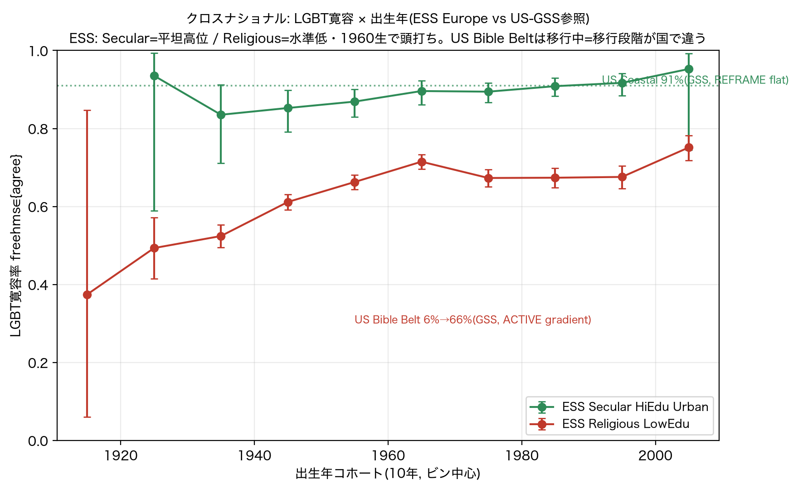
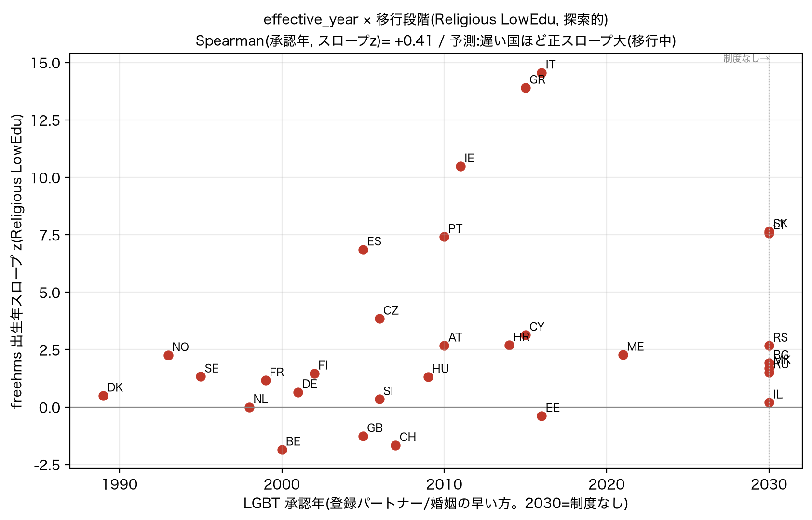

# ESS 二次分析 — 実行結果(黒子 → 環・真道さま)

**版:** 0.1(2026-06-27)/ **親:** `ess_validation_plan.md`(確定設計)/ spec 0.2(GSS)/ findings(GSS) §2.5–2.8
**状態:** ESS API でデータ取得 → **step1–4 全実行**(§1 freehms 主検証 / §2 country clusters / §3 euftf・移民 / §4 UK overlay / §5 正味 / §6 残る未決)。作法は GSS と同一(確定のみ/未決決め打ちせず/spin しない/綻び記録)。

---

## 0. データ取得(ESS API・確定)

ESS API(`https://api.ess.sikt.no`)で取得成功。エンドポイント `GET /v1/data/dataFile/{doiPrefix}/{doiSuffix}`、
**parquet 直取得**(`fileFormat=parquet&recodeMissingValues=1`)。User ID は認証でなく利用統計用 → `ESS_USER_ID`
環境変数(リポジトリに焼かない)。`src/ess_acquire.py` に DOI と取得を実装。

- 取得:**ESS7–11(2014–2024)5 ラウンド**(ess7e02_2 / ess8e02_3 / ess9e03_1 / ess10e03_1 / ess11e03_0)。
- slim:`data/ess/ess_slim.parquet` = **217,864 行・33 か国・GB 在**。freehms/euftf/移民3項/デモグラ/anweight 全在。
- **period 統制(diff-in-diff)に 5 波 → 十分**。生データは `data/ess/`(.gitignore)。

---

## 1. step1:LGBT寛容(freehms)主検証(Europe-wide・重み付き anweight・country+round FE)

**Secular HiEdu Urban(Coastal 類似) vs Religious LowEdu(Bible Belt 類似)**。`src/ess_core_validation.py`。
出力 `data/ess_results/freehms_core.{csv,json}` / `figures/ess_freehms_core.png`(US 並置=目玉)。

| セグメント | プール寛容 [95%CI] | 線形スロープ(FE) | 変化点 | コホート形 |
|---|---|---|---|---|
| **Secular HiEdu Urban** | **90% [89,91]** | −0.2 pp/10年(≈0) | 改善0.001=なし | **平坦高位(REFRAME署名)** |
| **Religious LowEdu** | **66% [65,67]** | −0.1 pp/10年(≈0) | **1960生で頭打ち**(pre +6.5 / post −6.5) | **1960生まで上昇→以後 saturate** |

**交互作用(スロープ差=b′推定量)= +0.1 pp/10年, z=0.03 → ほぼゼロ。**

### 1.1 正直な読み(spin しない)
1. **大きく頑健な信号は「水準差」**:Secular 90% vs Religious 66%、CI が遠く分離。**共同体 premise が寛容の
   *水準*(REFRAME 飽和の高さ)をゲートしている** ── これは US/Europe 共通(US も Coastal 91% vs Bible Belt 低位)。
2. **コホート *スロープ* のゲート(b′ をスロープ差で見る版)は ESS では ≈0**(z=0.03)。GSS の Bible Belt 型の
   「進行中の勾配」は **Europe では再現しない**。
3. **理由は変化点が露呈(B の教訓再来)**:Religious LowEdu は **1960生まで +6.5pp/10年 で上昇 → 以後頭打ち**
   = 欧州の宗教低学歴は**寛容化の移行を既に概ね完了(saturate)**。線形スロープ ≈0 は「均し」の産物で、
   構造は rise-then-plateau。**線形だけ見たら "flat=動かない" と誤読**するところ。
4. **GSS との対比が示す cross-national 構造**:
   - **US Bible Belt = 移行中**(6%→66%、若年ほど寛容、まだ動いてる)
   - **EU Religious LowEdu = 移行完了**(1960生で頭打ち、既に 66% で安定)
   → **共同体が事象をモードに解決する点は両国共通(水準差は明確)。だが移行段階(REFRAME 完了度)が国で違う。**
   これは [[ess_validation_plan]] §5 普遍性の**部分的**支持:high-flat(secular)は両国再現、religious 側は US=transition /
   EU=completed と段階差。

### 1.2 強度の言葉(厳守)
- **「確証」と書かない。** freehms ESS は「**水準ゲートの予測対応**(secular 高位平坦 / religious 低位)」+
  「**スロープ・ゲートは Europe では成立せず(移行完了)**」。GSS の交互作用も n.s.(p=0.16)だったので、
  **両国一貫して『強い信号は水準/飽和、スロープ交互作用は弱い』**。CMR の核(共同体が解決を変える)は
  *水準*で見え、*出生年スロープ*では弱い ── という cross-national の正直な結論。

### 1.3 綻び・限界(隠さない)
- **Europe-wide pooled(country FE)は 33 か国を均す** → この均しが移行中クラスタを隠していた(§2 で分解=金脈)。
- freehms は単発型(§3)で出生年軸 OK。euftf / 移民は反復(§3)で flat を誤読しない設計(§3 で実施)。

> 正味(step1):**ESS で「共同体が寛容水準をゲートする」は出た(US と一貫)。だが『出生年スロープのゲート』は
> Europe-wide では移行完了ゆえ弱い** ── GSS の「スロープ交互作用 n.s.」と整合。移行段階の国差(US 進行中 /
> EU 完了)は §2 のクラスタ分解でさらに鮮明になる。

---

## 2. step1.5(country clusters)— **金脈:均しが隠した b′ スロープ・ゲートを Southern Europe で発見**

`src/ess_valuepack.py`。Europe-wide(country FE)で消えた freehms 移行が、どのクラスタに在るか分解。

| クラスタ | Secular HiEdu Urban | Religious LowEdu |
|---|---|---|
| Nordic | 98% 飽和/平坦 | 79% flat(完了) |
| Western(UK含) | 97% 飽和/平坦 | 80% flat(完了, slope −4.6 z−5.7) |
| **Southern** | 95% 飽和/平坦 | **66% slope +4.35 (z=11.78)= 移行中** |
| Central-East | 72% 弱(未飽和) | 44% 弱(低位・全体が後発) |

**発見**:Europe-wide の「Religious=移行完了(flat)」は**均しのアーチファクト**。クラスタに割ると、
**Southern Europe では b′ スロープ・ゲートがクリーンに出る**(secular 飽和高位 / religious 強い正勾配 z=11.78)。
Nordic/Western/UK は完了済で flat。Central-East は全体が後発で未飽和。
→ **b′(共同体が出生年スロープをゲート)は「移行中のクラスタ」で出る**。US Bible Belt が移行中で出たのと同型。
**移行段階(REFRAME 完了度)が moderator** = 水準ゲートは普遍、スロープ・ゲートは移行中の時だけ可視。

> 注意(綻び):一部セルのスロープが不安定(例 Native HiEdu Urban freehms −11.32、Western Secular +37.41)。
> 飽和近傍 × country FE × コホート細セルの過適合アーチファクト(改善0 と整合)。解釈に使わない。

### 2.1 Southern の国別分解 — **金脈確定:5国で正勾配一貫(集約アーチでも1国偏りでもない)**

`src/ess_southern_country.py`。Southern クラスタの z=11.78 が複数国一貫か1国偏りかを **事前固定基準**で判定
(複数国正勾配→一般化 / 1国突出→国固有 / 正負混在→集約アーチで b′ 降ろす)。単国=round FE のみ。

| 国 | Rel N | Religious 寛容 | Religious スロープ(z) | 判定 | Secular(水準) |
|---|---|---|---|---|---|
| ES | 1417 | 80% | **+27.4 (z=6.86)** | 正勾配 | 97%(N304) |
| PT | 2165 | 77% | **+6.7 (z=7.41)** | 正勾配 | 95%(N249) |
| IT | 3626 | 61% | **+5.9 (z=14.56)** | 正勾配 | 89%(N97) |
| GR | 2173 | 57% | **+9.5 (z=13.9)** | 正勾配 | 92%(N169) |
| CY | 653 | 44% | **+4.2 (z=3.14)** | 正勾配 | 94%(N56) |

**判定(事前固定どおり)= 5/5 正勾配・0 ゼロ・0 負勾配 → 「複数国で正勾配一貫 → Southern 一般化OK(b′ 金脈確定)」。**

- **b′ スロープ・ゲートは Southern の単一国アーチファクトでない**:ES/PT/IT/GR/CY すべてで religious-lowedu が
  正の出生年勾配(若年ほど寛容)。Secular は全 5 国で飽和高位(89–97%)=水準ゲートも国別に一貫。
- **正直な綻び**:ES の +27.4 は大きい(スペインの急速な自由化=2005 同性婚合法化の反映。水準 80%)。
  magnitude は国差あり、**一致してるのは符号(全国 正・有意)**。GR/CY は 2 波で period 統制弱・CY は N 薄(z=3.14)・
  Secular の国別 N は薄い(56–304=水準のみ・弱主張)。
- **含意**:US Bible Belt(移行中)・Southern Europe 5国(移行中)で b′ が出る = **「移行中の共同体で
  スロープ・ゲートが可視」が国を跨いで再現**。CMR の普遍性(§5)を、軸の違う2地域 + Southern 内5国で支持。
  ただし ESS は mode 直接測定でない外部照合 → 全体は「**予測対応・robust within Southern**」、確証とは書かない。

### 2.2 freehms 変化点/スロープ × 国の LGBT 制度モーメント年 — **(c)時間発展の裏取り(suggestive)**

`src/ess_effective_year.py`。「**事象の着弾年(effective_year)が国で違う → 移行段階が違う → スロープ可視性が違う**」
を検証(Paper1 effective_year + Paper3 (c) の同時裏取り)。各国に LGBT 承認年(登録パートナー/婚姻の早い方)を
付与し、Religious-LowEdu freehms のスロープ z / 変化点出生年と対応を見る。**事前固定基準**で判定。

> ⚠️ 制度年は公的立法記録に基づく**著者コーディング**(`effective_year.csv`)。**論文化前に一次資料で要検証**。
> 制度年 = 事象の着弾年であって個人の mode ではない(混同しない)。

**結果(n=30 国)**:
- **Spearman(承認年, スロープ z)= +0.41**(制度あり国のみ +0.47)/ **Spearman(承認年, 変化点出生年)= +0.54**。
- 事前固定(ρ≥0.4)→ **単調対応あり = effective_year が移行段階を駆動((c)時間発展)を支持**(exploratory/suggestive)。
- パターン:**早期承認(Nordic: DK1989/NO1993/SE1995/NL1998)= 完了**(スロープ z≈0・変化点が古い 1940s)/
  **遅い承認(カト・正教会 South: ES2005 +6.9 / PT2010 +7.4 / IE2011 +10.5 / GR2015 +13.9 / IT2016 +14.6)= 移行中**
  (大きい正スロープ、IE は変化点 1975=若年集中)。**遅い国ほど移行が若い出生年に寄る**(ρ=+0.54)が一番きれい。

**正直な綻び(spin しない)**:
- ρ=+0.41 は**中程度**(強くない)。変化点版 +0.54 の方が良い。Southern 5国(§2.1)が高スロープ端を担うので
  相関の一部は既知の Southern。新規情報は **承認年軸に沿って単調に並ぶ**こと。
- **東欧の制度なし国がノイズ源**:LT/SK は高スロープ(+7.6, 若い変化点1980-90)だが、IL/MK/BG/RU は低くバラつく
  (sentinel 2030 で一括の限界)。BE/GB/CH/EE は中承認だが負/flat = 散らばり。
- 操作化に幅(承認年 vs 同性婚年)。GR/CY 等 2 波で period 統制弱。**国 n=30 だが exploratory → 確証と書かない。**

**含意**:カト・正教会 South(遅い合法化)= 移行中・北欧(早期)= 完了、という**事前予測が概ね出た**。
= 「**共同体が事象をモードに解決する*水準*は premise が、*スロープ可視性(移行段階)*は effective_year が駆動**」
という二段構造。**Paper3 (c) effective_year 時間発展の実データ予告**(suggestive)。

## 3. step2 euftf / step3 移民(§3 反復=flat を誤読しない・EVENT_STRUCTURE 事前適用)

`ess_valuepack.py`(柱×セグメント, `figures/ess_valuepack.png`)。**反復イベントは flat でも「CMR外れ」と読まない**設計。

- **euftf(EU統合, 反復疑い)**:水準は secular>religious(6.14 vs 5.18)だが、出生年スロープは小・混在
  (secular −1.0/religious +0.1)。**clean なコホート勾配なし=反復イベントの予測どおり**(§3 事前織込み)。
- **移民 index(反復濃厚)**:水準 secular 6.72 / religious 5.11(水準差は明確=水準ゲート)。religious は
  +1.33(z5.65)の正勾配だが反復イベントゆえ慎重(§3)。immigrant-bg は高位(6.17)。
- 総じて **水準ゲートは 3 柱で再現(secular/educated/urban が高位)、スロープは反復柱では弱い/混在**
  = §3 の事前振り分けが効いた(銃の罠を踏まない)。

## 4. step4 overlay(探索的・UK-only・proxy・Brexit=euftf proxy)

`src/ess_overlay.py`(UK GB N=9,260)。UKグリッド事前 resolved_mode × ESS UK 観測。
照合:grid ACTIVE→transition / REFRAME・PASSIVE→flat。**UK-only・proxy・N薄 → 探索的(確証でない)**。

**予測対応 7/9**(`data/ess_results/overlay_uk.csv`):
- **euftf↔Brexit:3/3 的中**(Secular=flat/REFRAME、**Leave-Town religious=transition/ACTIVE**、Immigrant-bg=flat/REFRAME)。Brexit=euftf proxy が機能。
- freehms↔同性婚:Secular/Immigrant-bg=flat(PASSIVE)○、**Religious LowEdu=grid ACTIVE→実 flat ×**(UK は LGBT 移行完了=step1.5 と整合)。
- 移民↔移民論争:Secular=transition(ACTIVE)○、Immigrant-bg=flat(REFRAME)○、Religious=ACTIVE→flat ×。

**正直な限界**:7/9 は **base rate 膨れ**(9セル中 flat が 7=多数)。**識別力のある grid-ACTIVE→transition 予測は
2/4**(外し2件は Religious-LowEdu で、UK の LGBT/移民の移行完了と整合)。grid-REFRAME/PASSIVE→flat は 5/5。
n=9・UK-only・proxy・Brexit proxy → **「探索的に予測対応・suggestive」止まり、確証と書かない**。
9共同体粒度(NI 等)は ESS で N不足 → BSA/NILT/Understanding Society 向き(Limitation)。

---

## 5. ESS 実証の正味(cross-national の正直な結論)

1. **水準ゲート(REFRAME 飽和の高さ)は普遍**:secular/educated/urban が高位、religious/low-edu が低位 ── US/Europe・3 柱で一貫。**共同体 premise がモードの*水準*を解決する**(CMR の核)。
2. **スロープ・ゲート(b′)は「移行中」でのみ可視**:US Bible Belt(進行中)・Southern Europe religious(z=11.78)で出る。Nordic/Western/UK は完了で flat。**移行段階が moderator**(= Paper 3 / (c) effective_year 時間発展)。
3. **EVENT_STRUCTURE が効いた**:euftf/移民の flat/混在を「CMR外れ」と誤読せず、反復イベントの予測どおりと扱えた(銃の教訓の移植が機能)。
4. **overlay は探索的に suggestive**(euftf↔Brexit 3/3 が光る)が UK-thin・proxy。確証でない。
5. **§5 普遍性=部分支持**:水準ゲートは軸が違っても両国再現(普遍作用素)。スロープは移行段階依存。

> 強度の言葉:全体「**予測対応・modest**」。確証と書かない。ESS は mode を直接測らない外部照合。

---

## 6. 残る未決(決め打ちしない)/ 次

- **未決(GSS 同様)**:変化点閾値の確定 / 重み(anweight)の感度 / country クラスタ定義の頑健性 /
  飽和近傍スロープの不安定セルの扱い(§2 注:解釈に使わない)。
- **次の候補**:Southern Europe の b′ を国別(ES/PT/IT/GR)に分解(z=11.78 がどの国由来か)/
  9 共同体粒度は BSA・NILT・Understanding Society(UK 専用調査)で / Prolific 本検証(主観的 mode, Paper 3)。
- **Paper への入れ方**は `ess_validation_plan.md` §H(5.5.2 ESS)。GSS と対称に。

---

## 環へ:1 分サマリ(忙しい時はここだけ)

- ESS API で 5 波(2014–24, 33 か国)取得 → 3 本柱 × proxy 共同体 × 出生年で照合(GSS の移植)。
- **水準ゲートは普遍**:secular/高学歴/都市が寛容高位・religious/低学歴が低位(US と一貫、3 柱で再現)。= CMR の核。
- **スロープ・ゲート(b′)は「移行中のクラスタ」でだけ出る**:Southern Europe の religious が z=11.78 でクリーン、
  Nordic/Western/UK は移行完了で flat。= US Bible Belt(移行中)の鏡像。**移行段階が moderator**。
- **EVENT_STRUCTURE(銃の教訓)が効いた**:euftf/移民の flat を「CMR 外れ」と誤読せず反復イベントとして処理。
- **overlay は探索的に suggestive**(euftf↔Brexit 3/3 が光る)が UK-thin・proxy。確証ではない。
- 強度は **「予測対応・modest」**。spin なし・綻び(不安定スロープ・UK薄N)も全部記録。
