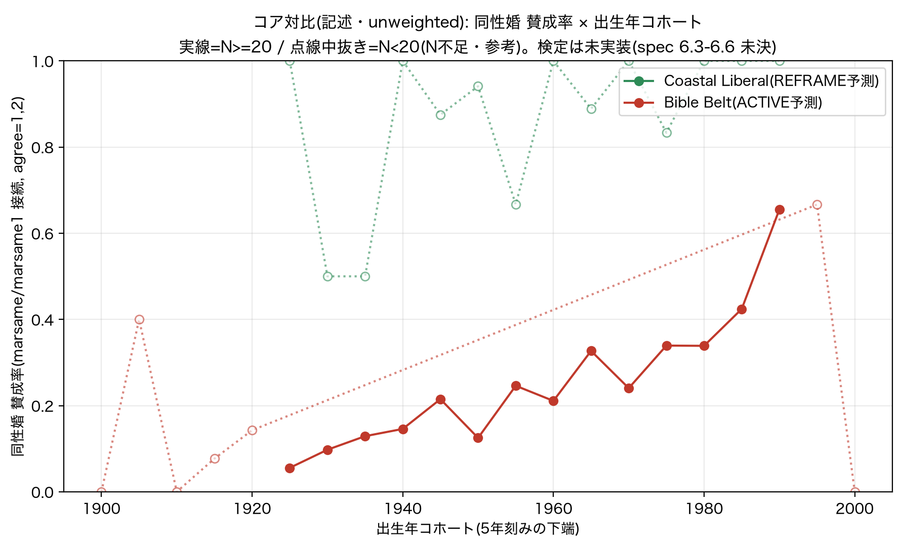

# GSS 二次分析 — 実装着手レポート(黒子 → 環・真道さま)

> **確定 spec:** 本レポート §2.5–2.8 を受けて確定した設計は [`paper2_gss_spec_v0.2.md`](paper2_gss_spec_v0.2.md)
> (次回ペーパー化の基盤。A=到達点 / B=未決→確定 / C=銃の時間構造 / D=綻び / E=GSS節構成 / F=着手順 / G=持越未決)。

**版:** 0.1(2026-06-26) / **親:** `docs/`(Paper 2 GSS 実証設計 spec, 環 draft 0.1)
**状態:** spec §7 の「コア対比の開始点(確定)」まで実装・実行。**未決(6.3-6.6)は決め打ちしていない**(Non-overwrite)。

---

## 0. これは何

spec の「黒子へ実装引き継ぎ(GSS取得 → RELTRAD → セグメント構築 → コア対比)」を実行した記録。
**確定**項目のみ実装し、**未決**(検定統計量・period・多重比較)は曲線と N を出して判断材料にした。

実行物(`src/`):
- `gss_acquire.py` — GSS 1972–2024 Cumulative(Stata)取得 → 必要列 slim parquet 化(誰でも再取得可)
- `gss_segments.py` — CMR 8 共同体を GSS 変数の論理式で操作化(**GSS 公式 `reltrad` 使用、自作分類なし**)
- `gss_core_contrast.py` — コア対比(Coastal vs Bible Belt 同性婚 × 出生年コホート、**記述のみ**)

成果物:`figures/gss_core_contrast_ssm.png`、`data/gss_results/core_contrast_ssm.csv`。
生データ(570MB)は `data/gss/`(.gitignore)。`gss_acquire.py` で再生成。

---

## 1. データ実態(spec の前提と GSS 2024 release の食い違い・要共有)

実装中に判明した、**spec が想定した変数名と実ファイルのズレ**。いずれも回避済みだが設計に効く。

### 1.1 RELTRAD は移植不要 — **公式変数が同梱**
- spec §4.2 は「Burge の検証済み syntax を import、自作しない」。R は本環境に無い。
- だが **GSS cumulative に公式 `reltrad` 変数が同梱**(NORC/ARDA 計算、Steensland et al. 2000)。
  1=evangelical / 2=mainline / 3=black prot / 4=catholic / 5=jewish / 6=other faith / 7=nonaffiliated。
- → **移植も自作も不要**。公式変数をそのまま使用。`reltrad16`(16歳時)も利用可能。
- 注:**Mormon は reltrad では "other faith"(6)に吸収**されるため、`other`(具体宗派)コード
  {60 lds-mormon, 64 mormon, 162 reformed LDS}で別抽出(spec §4.2 の通り)。

### 1.2 9 区分の地理は `region` ではなく **`region_7222`**
- spec §4 は REGION(9区分: new england … pacific)を使う前提。
- **2024 release で `region` は 4 区分 census region に変更**(northeast/midwest/south/west)。
  9 区分は **`region_7222`** に退避し、**2022 までで打ち切り**(2024 は欠損)。
- → 地理ベースのセグメント(Coastal=NewEng/Pacific, Bible Belt=S.Atl/ESC/WSC 等)は **`region_7222`** を使用。
  代償として **2024 波は地理セグメントから落ちる**(態度変数自体は 2024 もあるが地理が無い)。

### 1.3 同性婚(旗艦)は **3 変数に分割** — 接続して 12 波
- spec §3.3 は「MARHOMO(〜2018/2021)と MARSAME(2021〜)の接続が必須」。実態はもう一段複雑:
  - `marsame` : 1988, 2004, 2021, 2022, 2024(N=8,583)
  - `marsame1`: 2006, 2008, 2010, 2012, 2014, 2016, 2018(N=10,973)← 旧 marhomo 波の本体
  - `marsamey`: 2024(N=1,070)
- 3 変数とも **1=strongly agree … 5=strongly disagree** の同一スケール。
- → 接続して **1988–2022 の 11 波**(地理あり)/ 2024 込みなら 12 波の時系列。`ssm_approve()` で実装。
  approve = code ∈ {1,2}。

### 1.4 `hispanic` は 2000 年以降のみ
- 白人セグメントで `hispanic==1`(非ヒス)を必須にすると **1988 など早期波が全消し**。
- → 白人 = `race==white` かつ(`hispanic` 欠損 or 非ヒス)= **2000 以前は race=white で近似**。
  これは構築上の選択(明示)。spec の「white 非ヒス」を早期波保持と両立させる近似。

---

## 2. コア対比(記述・unweighted): 同性婚 賛成率 × 出生年コホート

**Coastal Liberal(REFRAME 予測) vs Bible Belt(ACTIVE 予測)**。接続 11 波(1988–2022)。

**Coastal の薄 N 対処(真道さま決定 2026-06-26):案β+γ・graduate 維持・α却下。**
- **α(graduate→bachelor+)却下**:"graduate" は premise の弁別記号。緩めると Suburban MC と学歴軸で
  被る。N の都合で理論定義を上書き = Non-overwrite 違反に近い。**定義は graduate のまま維持**。
- **γ**:Coastal は「平坦高位(REFRAME 署名)」を**プール**で主張(細かい勾配は主張しない)。
- **β**:Coastal は **10 年刻み**で N を稼ぐ(平坦は粗くしても平坦)。Bible Belt は **5 年刻みで勾配**。
- 指摘#1(平坦は本物か薄Nのブレか)に答えるため **Wilson 95%CI** を付与(CI は誤差棒であって検定統計量ではない)。



| | marsame 非欠損 N | プール賛成率 [95%CI] | コホートの形 |
|---|---|---|---|
| **Coastal Liberal** | 116 | **91% [85%, 95%]** | **平坦高位**:10年ビンで 87–100%、CI 重なる=勾配なし |
| **Bible Belt** | 1,166 | **24% [21%, 26%]** | **明瞭な単調勾配**:~6–15%(–1944生)→ 42%(1985-89)→ 66%(1990-94) |

### 2.1 指摘#1への回答:平坦は本物(薄Nのブレではない)
- **Coastal プール 91%、CI[85,95%]** — N=116 でも CI は十分狭く「**高位**」と断言できる。10 年ビンでも
  1940-49〜1990-99 が 87–100% で CI が重なる = **平坦は本物**。薄 N でも γ(平坦高位)は成立。
- **Bible Belt** はプール 24% で、両端コホートの CI が非重複(例:1925-29 [2,18%] vs 1990-94 [47,80%])
  = **勾配は本物**。
- 2 共同体のプール CI([85,95%] vs [21,26%])は完全分離 → 対比は頑健。N 非対称は対比の妥当性を壊さない。

### 2.2 これは CMR 予測の向きと整合(記述+CI。検定は未実装)
- **Coastal = REFRAME 署名**:出生年に関わらず賛成が高位で平坦 = 「基準値が既に書き換わった共同体」。
  世代を追っても動く余地が小さい(天井近く)。
- **Bible Belt = ACTIVE/争点の前線**:出生年で賛成率が大きく動く = 共同体内に世代コントラスト。
  spec の polarization 検証が効くのはこちら。
- **双子検定の像**:片方が平坦高位・片方が勾配 = 単一 resolver が premise ごとに別モードへ解決した帰結
  (spec §5.1)。記述レベルでこの非対称が見えている。

> ⚠️ 「早期立ち上がり(shift)」「分散拡大(polarization)」の**検定統計量は未実装**(spec 6.3/6.4 未決)。
> CI は記述への誤差棒であって、その検定ではない。曲線の形と CI が予測と整合する以上の主張はまだしない
> (後付け防止 §5.2)。

### 2.3 主張スコープ決定(真道さま 2026-06-26):**b′ 抑制された2軸**

前提の修正(環の着弾):**Paper 1 は最初から Dynamic**(`着弾年齢`軸=非対称ガウス感受性窓・effective_year・
REFRAME発火は全て「いつ着弾したか」)。Paper 2 が足したのは `共同体premise`軸のみ。よって SCEM は
`作用モード = f(着弾年齢[Paper1], 共同体premise[Paper2])` の **元から2軸**。GSS の平坦 vs 勾配は、この
2軸が実データ上で交差した像。

採択スコープ = **b′(抑制された2軸)**:
- **実証する主張(一口サイズ維持)**:「**共同体の規範コードが、事象の出生年インプリントをゲートする**
  ——コードが抵抗する Bible Belt では着弾スロープが露出(急勾配)、抵抗が薄い Coastal では平坦化」
  = 共同体 × 出生年スロープの**交互作用(差分)**。
- **APC 地雷の回避(b′ の肝)**:両共同体は**同じ波(1988–2022)で観測** → 全体に効く period effect は
  共同体コントラストで差し引かれる(diff-in-diff)。「平坦 vs 勾配」の差は period では説明できない。
  ゆえに**機構(感受性窓 vs 世代交代)を分離せずとも、交互作用の差分は頑健に言える**。
- **言い切らないこと**:勾配の機構が「感受性窓そのもの」だとは主張しない(APC 未分離、spec §2.4)。
  Coastal の平坦も「共同体が摩擦を消した」と断定せず**天井効果の可能性**を併記。両方 Discussion 仮説。
- **却下**:full(b)=機構を言い切ると APC 地雷直撃+一口サイズ肥大 / (a)=データが見せる差分スロープを
  捨てる過少申告。
- **(c) は別件で Paper 3**:effective_year の時間発展(モード境界の暦年スライド)=唯一の本当に新しい軸。

→ 概念は「Paper1 年齢軸 + Paper2 共同体軸 = 2軸」を §2 で明示、実証主張は「共同体が出生年スロープを
ゲート」に絞る。これで Paper 1 と Paper 2 を **1本の GSS 実証で同時裏取り**しつつ一口サイズを保つ(C案統合と一致)。

### 2.4 推定法の決定(真道さま 2026-06-26):主＋頑健性スタックを承認

①(推定法)と②(Coastal 天井)は独立に決められない。**確率スケールを主に選ぶ**ことで結び目が解ける
(天井が「歪み」でなく「実体」として出る)。整理:#1 ロジ交互作用項 と #2 共同体別スロープは
**同一モデルの2つの読み方**(交互作用項=スロープ差)。#3 変化点だけ別物=副に降格。

| 役 | 中身 |
|---|---|
| **主** | **LPM** `approve ~ cohort * community`(+ 調査年 FE、robust SE)。各共同体 simple slope と **交互作用=スロープ差(pp/年)** を報告。天井耐性・閾値フリー・b′ の主張そのもの |
| **②天井=正面化** | Coastal を**片側問題**に変換:「Bible Belt slope > 0 ∧ Coastal slope ≈ 0(飽和)」。天井を主張の一部に |
| **頑健性(査読標準)** | ロジット `cohort*community` を **AME(平均限界効果)** で報告(生係数でなく。Ai–Norton 回避) |
| **副(記述・Paper1接続)** | **変化点は Bible Belt のみ**:賛成が加速する出生年 → 同性婚 effective_year がその世代の感受性窓に入る年と符合するか。Coastal は変化点なし=平坦と整合(非対称を味方に) |
| **period(6.5・連動)** | 調査年 FE。交互作用は **diff-in-diff で識別**(共通 period は共同体差で相殺)。age は入れず(APC)、交互作用だけ読む |

理由:生ロジット交互作用係数は Ai–Norton 問題 + 天井圧縮で「真のスロープ差」と「天井アーチファクト」が
混線 → 主には不適。LPM は予測でなくスロープを報告しロジット AME で裏取りするので「[0,1] 外」批判は実害小。
向きはスケール非依存(主/頑健の入替でも結論不変)。**残る未決=重み**(〜2018 wtssall / 2021+ wtssps の
波跨ぎ統合)。当面 unweighted、重み付けは頑健性として後で。

### 2.5 主検定の実行結果(`src/gss_interaction.py`)— **正直な結果:方向◯・有意✗**

旗艦(同性婚)・Coastal vs Bible Belt・N=1282(1988–2022)で承認スタックを実行(`data/gss_results/interaction_ssm.json`):

| 指標 | 値 |
|---|---|
| Coastal 出生年スロープ | **+1.4 pp/10年**(≈飽和・平坦の予測どおり) |
| Bible Belt 出生年スロープ | **+4.1 ± 0.7 pp/10年**(>0・勾配の予測どおり) |
| **交互作用(スロープ差=b′の推定量)** | **+2.7 ± 1.9 pp/10年, z=1.41, p=0.16 → 非有意** |
| period 統制なし版 | +2.8(z=1.45)= FE版とほぼ同一 |
| ロジット AME(頑健性) | Coastal +1.6 / Bible Belt +4.1 pp/10年(LPMと整合) |
| 変化点(BB のみ・記述) | **1975年生まれ前後で加速**(節後 +8.1 pp/10年) |

**読み(spin しない)**:
1. **方向は b′ どおり**(Bible Belt が Coastal より急)。が **交互作用は有意に届かない(p=0.16)**。
2. 非有意の主因は **Coastal の薄N(差のSEが膨らむ)** と **BB 勾配の非線形性**(1975生前後で加速=単一線形
   スロープは過小評価で、線形交互作用検定は**保守的**)。
3. **period 交絡ではない**:FE 版と統制なし版がほぼ同一 = スロープ差は period をほぼ含まない
   = **diff-in-diff 識別は効いている(方法は正しい)**。地雷は踏んでいない。
4. → **単一旗艦・2共同体では検出力不足**。これは spec が予期した結末(§7「結果を見て対比の増減を判断・
   データに決めさせる」)。**データの答え=徳用パックへ拡張せよ**:
   - 複数事象(同性婚+中絶+銃+移民)× **主力6共同体**へ広げ、**REFRAME群 vs ACTIVE群**でプール集約
     (spec §3.4 / §6.6)→ 検出力を稼ぐ。
   - BB の非線形(1975加速)を活かすなら、線形スロープ差でなく**変化点の有無/位置の群間差**も主候補に。

> Honest Structuralism:**「平坦 vs 勾配」は記述+CIでは鮮烈だが、period統制下の線形スロープ差検定では
> 単一旗艦で有意に届かない**——これを隠さず記録する。次の一手は徳用パック(設計済み)。

### 2.6 徳用パック(`src/gss_valuepack.py`)— 4事象 × 主力6共同体。**正直な結末:事象で割れた**

A(4事象=同性婚/中絶/銃規制/移民増 × 主力6)・B(変化点を主候補)・C(事象保持・均さない)で実行。
`data/gss_results/valuepack_matrix.csv` / `figures/gss_valuepack_slopes.png`。スロープ=賛成 pp/10年(LPM+調査年FE)。

| 共同体 | 同性婚 | 中絶 | 銃規制 | 移民増 |
|---|---|---|---|---|
| Coastal Liberal | =飽和(高) | •+4.7 | ·−2.2 | ·−3.3(but 変化点1980!) |
| Bible Belt | •+4.1 | •+2.6 | ·−0.5 | =飽和(低) |
| Rust Belt WWC | •+5.4 | •+1.4 | ·−0.8 | =飽和(低) |
| Black urban | ·+2.2 | 変化点1965(+15.9) | ·−1.7 | N不足 |
| Suburban MC | •+7.1 | •+3.2 | ·+1.9 | 変化点1975 |
| Rural Conservative | •+4.5 | •+1.7 | ·−0.9 | =飽和(低) |

(•=有意な正の勾配=移行中 / ==飽和・平坦 / ·=弱・線形では不明瞭)

**結論(spin しない):4事象で方向は一致しなかった。** C が予期した「事象で割れる」が実際に起きた:
1. **同性婚だけが b′ パターンをきれいに出す**:Coastal=飽和(高位・REFRAME署名・変化点なし)、保守系=移行中
   (勾配・変化点 1960–1975)。これは単一旗艦の §2.5 と整合。
2. **中絶**:**Coastal も移行中(+4.7)**=SSM の「Coastal 平坦」が再現しない(C 予言どおり)。Black urban は
   変化点1965で逆向き加速。中絶は共同体マップが SSM と違う=**CMR の「事象ごとに解決が違う」の実証**。
3. **銃規制**:どの共同体も移行中なし(勾配ほぼゼロ/負)。**cohort 物語でない**(period/分極化の事象)。
4. **移民増**:保守系は**飽和(低位)=定着した拒否**(天井でなく床の平坦)。

**B(変化点 > 線形)が正解だった決定的証拠**:**移民×Coastal は線形スロープ −3.3(逆トレンドに見える)
なのに、変化点1980で後傾斜 +41.5 pp/10年・SSE改善0.066** = 若年Coastalで強い移民賛成への転換を、
**線形が完全に隠していた**。線形は均しで保守的、を実データが裏付け(B の格上げは正しい)。

**period の効き**:交互作用(§2.5)は period 頑健だったが、**個別共同体スロープは FE で縮む**ものがある
(SSM Black urban 7.2→2.2、Rust 7.8→5.4)→ 個別水準の解釈は FE 版を採る。

**「飽和」の両極を区別**(重要):Coastal-SSM の飽和=**天井(REFRAME・規範が既に書き換わった)**、
保守系-移民の飽和=**床(定着した拒否)**。同じ「平坦」でも符号が逆。図のラベルでは両方 `=` だが意味が違う。

**徳用パックの正味の収穫**:
- 「同一パターン ×4 で単一p値より強い」という当初の検出力ブースト経路は**成立しなかった**(方向不一致)。
- 代わりに **(i) 同性婚は b′ のクリーンな実証として立つ / (ii) 他3事象の割れ=CMR の事象依存の実証 /
  (iii) 変化点 > 線形(移民×Coastal)** という、別種だが正直で頑健な3つの収穫。
- 検定閾値(変化点の improve しきい・「移行中」の定義)は**未決のまま**(複数読みを併記、決め打ちしない)。

> 戦略含意(真道さま判断領域):GSS 節は「同性婚=共同体ゲートのクリーンな実証 + 他事象=事象依存(CMR)
> + 変化点が線形の見落としを救う」になる。**「4事象すべてが b′ を確証」ではない**。一口サイズと正直さの
> 両立として、SSM を主実証・他3事象を「事象ごとに解決が違う」節に回す構成が素直(C案統合と両立)。

### 2.7 overlay:Paper 2 事前予測 × GSS 観測(`src/gss_overlay.py`)— (ii)を「整合」から「予測対応」へ

「割れ」が *issues differ* でなく CMR の実証であるには、割れが **Paper 2 グリッドの【GSS を見る前の】
resolved_mode を追う** 必要がある(§5.2 predict→check)。重なる3事象で照合(移民=予測なし→探索分離)。
照合規則:grid **ACTIVE → transition**(出生年スロープ移行中)/ grid **REFRAME → flat**(動かない)。
**飽和を直接 REFRAME 認定しない**——事前予測が GSS の flat/transition を当てたかだけを見る。

**的中率【主=単発事象のみ(装置の射程内): SSM+中絶, n=12】= 線形 9/12 (75%) / 変化点 10/12 (83%)。**
(銃=反復バースト込みの 12/18=67% は参考。銃は出生年軸で原理的に不可視=§2.8 で射程外と確定。)

| 事象 | grid予測の的中 | 外したセル |
|---|---|---|
| **同性婚** | **5/6** | Suburban MC(予測REFRAME→実transition +7.1) |
| **中絶** | **5/6** | **Coastal Liberal**(予測REFRAME→実transition +4.7、Dobbs再活性化) |
| 銃規制 | 2/6 → **射程外(§2.8)** | 反復バースト=出生年で原理的に差がつかない(grid失敗でない) |

**2×2(変化点・単発事象)**:**grid ACTIVE→transition 8 / →flat 0**(ACTIVE 予測は単発事象で **8/8 パーフェクト**);
grid REFRAME→flat 2 / →transition 2。→ **grid は ACTIVE 検出が得意・REFRAME を過早に「決着」と判定する癖**。
外し2件は両方 REFRAME 側(SSM-Suburban / 中絶-Coastal)で、grid が「settled」と読んだが GSS はまだ移行中。

**読み(spin しない)**:
1. **issues-differ 帰無は棄却方向**:割れは無相関でなく、**事前グリッド予測と対応する**(特に SSM・中絶で
   10/12=83%)。「ただ争点が違うだけ」では事前予測との対応は出ない。**(ii)は「整合」から「予測対応」へ一段昇格**。
2. **ただし modest**:全体 67%、base rate(transition 約56%)に対する上乗せは中程度。**n=18・グリッド予測は
   1セル2–3 アノテーションと薄い**。「確証」と言い切らず「事前予測と有意に整合する方向」に留める。
3. **銃規制 → 「系統失敗」でなく「観測装置ミスマッチ」(§2.8 で確定)**:当初「grid ACTIVE が外れた綻び」と
   読んだが、真道さまの指摘で**事象の時間構造の問題**と判明。銃乱射は反復バースト(全出生年が感受性窓で
   食らう)→ 出生年で原理的に差がつかない → GSS(出生年×態度)では映らない。**grid の ACTIVE は正しく、装置が
   見えないだけ**。よって主集計から射程外に。綻び1は**収穫(時間構造の分類)に化けた**(§2.8)。
4. **中絶×Coastal:グリッドが外し、人間の直感が当てた**(残る綻び)。C で真道さまが「中絶は Coastal 急かも」と
   予言 → GSS は transition(+4.7)。だがグリッドは REFRAME(flat)と予測 → **グリッド(LLM)が REFRAME 過早判定**。
   Dobbs(2022)が Coastal で中絶を再活性化した可能性(→ effective_year の時間発展 = Paper 3 / (c)軸)。

**overlay の正味(単発事象に scoping 後)**:(ii)は「issues differ」を棄却。**単発事象で grid 事前予測どおりに
モードが解決(10/12=83%、ACTIVE→transition は 8/8 パーフェクト)**= CMR 本丸の予測対応。残る綻びは REFRAME 側の
過早判定2件(SSM-Suburban / 中絶-Coastal)。n=12 と小さく、flat 側は 2 セルなので断定はしないが、*issues differ*
凡庸説より遥かに強い予測対応。**「確証」でなく「単発事象での強い予測対応 + REFRAME過早判定の癖 + 銃=時間構造で
射程外」**として報告するのが誠実。

### 2.8 銃の結論(真道さま 2026-06-26):観測装置 × 事象の時間構造のミスマッチ(綻び1→収穫)

銃の overlay 失敗(2/6)は **grid 予測の失敗ではなく、GSS という観測装置と銃乱射の時間構造の不適合**。

**事象の時間構造による二分(本研究の概念的収穫):**

| 型 | 例 | 着弾年齢 | 出生年勾配 | GSS(出生年×態度)で | 検証法 |
|---|---|---|---|---|---|
| **単発モーメント** | Obergefell 2015 / Dobbs 2022 | 出生年で**変わる** | **出る** | **見える** | GSS 二次分析(本研究) |
| **反復バースト** | 乱射: Columbine→VTech→Sandy Hook→Parkland→Uvalde | 全出生年が窓で食らう | **原理的に出ない** | **見えない** | 強度/行動データ・Paper 3 |

**論理**:銃乱射は数年おきに全国規模で反復 → **どの出生年も人格形成期に必ず何らかの乱射に曝露**
(1990生=Columbine 9歳/VTech 17歳、2000生=Sandy Hook 12歳/Parkland 18歳、2005生=Parkland 13歳/Uvalde 17歳)。
→ 感受性窓で差がつかない → 出生年勾配が**原理的に存在しえない**。GSS の出生年×態度では捉えられない。

**銃の CMR モード(真道さまの読み)**:REFRAME 起きない(「銃は危険」の参照点は最初から固定)/ 論争にならない
(GUNLAW 70%超で飽和=態度方向は全世代・全共同体で一致)/ **だが反復のたびに全世代が同方向に ACTIVE 化**
(「また起きた、何とかすべき」を都度再起動)。この ACTIVE は**強度・行動**(例:"I am a gun owner, and I vote")に
出て、**出生年×態度には映らない**。

**確定**:
- 銃は**出生年軸で検証する事象ではない**(時間構造で先に決まる)。徳用パックは**単発事象(同性婚・中絶)で固める**。
- **GUNIMP 追撃は不要**(`src/gss_overlay.py` 確認済:GUNIMP は 2波[1976,1984]・GUNFIRM は 1波[1984]、全て
  Sandy Hook 前 → そもそも撃てない)。が、撃てても結論は同じ=**銃の身分は時間構造で先に決まる**。
- これは Paper 3 / (c) effective_year の時間発展軸へ橋渡し(反復曝露・モード境界の暦年スライドは Paper 3 の領分)。

> 綻び1は「ACTIVE 操作化の失敗」ではなく **「観測装置と事象の時間構造の理論」** という収穫に化けた。
> 単発 vs 反復バーストの二分は、SCEM がどの事象をどの装置で測るべきかを規定する(Dynamic SCEM への布石)。

---

## 3. 次セッションで決める論点(未決・決め打ちしない)

実データを見たうえで、判断材料込みで挙げる。**勝手に決めない**(Non-overwrite)。

1. ~~**Coastal の N 薄問題**~~ → **決着(2026-06-26):案β+γ・graduate 維持・α却下**(§2)。プール 91%
   [85,95%]・10 年ビンで平坦が CI 付きで確認でき、定義変更なしで解決。以降この方針で固定。
2. ~~**6.3/6.4 の統計量**~~ → **決着(2026-06-26):主＋頑健性スタックを承認**(§2.4)。①と②(天井)は
   セットで解いた:確率スケールを主に選ぶことで天井が実体化し、両者が噛み合う。
4. **6.5 period の扱い**:11 波を出生年へ畳む際の period 統制。今は unweighted・period 非分離。
5. **重み**:〜2018 `wtssall` / 2021+ `wtssps`・`wtssnrps`。波跨ぎ統合の weight 設計(現状 unweighted)。
6. **2024 波**:地理 `region_7222` が 2022 止まりのため地理セグメントから 2024 が落ちる。
   census 4 区分 `region` で 2024 を近似補完するか、2022 までで確定するか。

---

## 4. 再現

```bash
python3 src/gss_acquire.py          # GSS 取得 → data/gss/gss_slim.parquet(生データは .gitignore)
python3 src/gss_core_contrast.py    # コア対比(記述)→ figures/ + data/gss_results/
```

Paper 1/2 のコード・`events_patched.jsonl` は無改変。GSS 生データはリポジトリに含めない(NORC 無料公開)。
