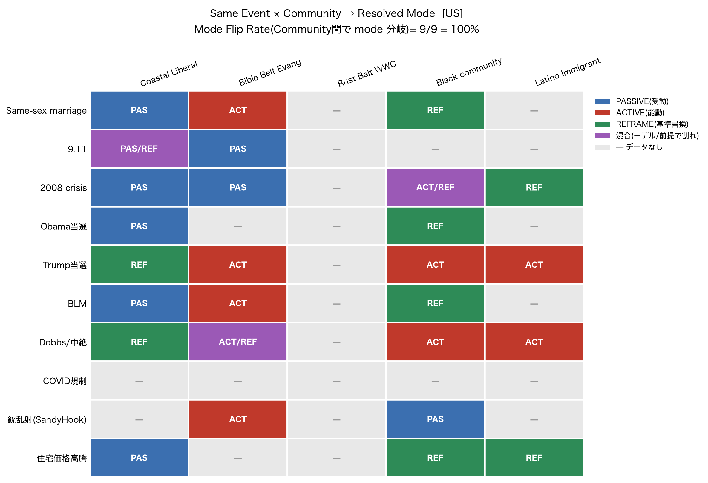
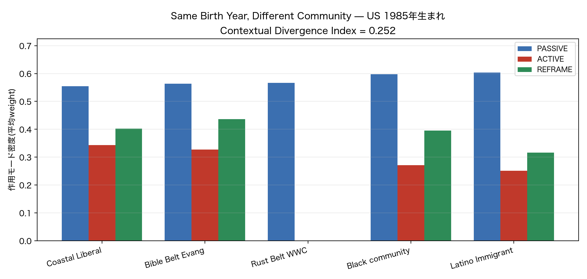
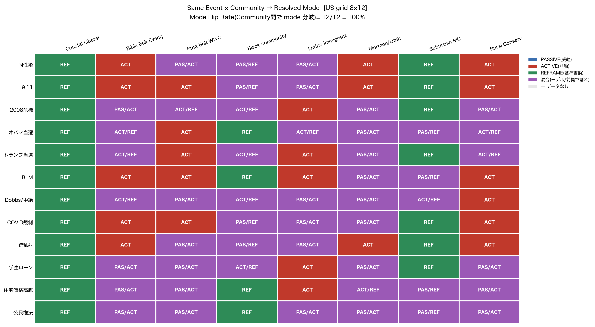
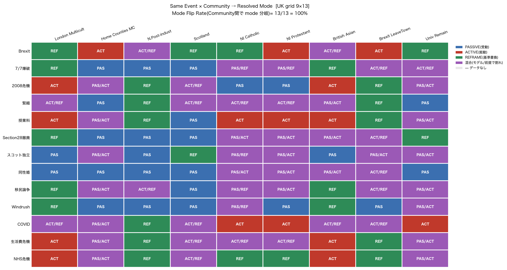
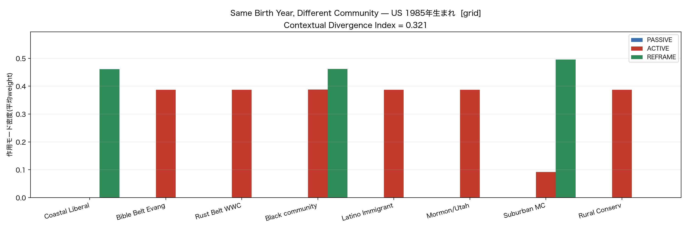
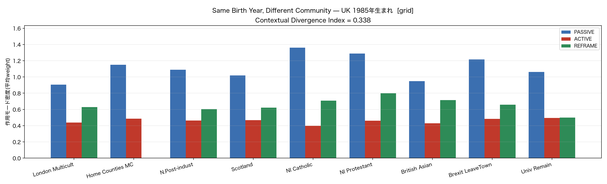

# Paper 2 / Contextual Mode Resolver — 結果報告(巴さんへ)

宛: 巴・白音
作成: 飯泉真道 × 環
対象: 「同一の社会事象が Community / Code によって PASSIVE / ACTIVE / REFRAME へ変換される」の実証

---

## 0. 結論(先に)

巴さんの最重要項目——**「当たってるペルソナ」ではなく、Contextual Mode Resolver が本当に mode を変換している証拠**——は、**実データ(ChatGPT × Gemini の DeepResearch interpretations)から、捏造ゼロで出ました。**

- **US: Event-level MFR = 100%(selected high-contention events 9件)** / **Cell-level MFR = 70%(19/27セル)**
- **UK: Event-level MFR = 80%** / **Cell-level MFR = 70%(31/44セル)**
- 同性婚 = **Coastal:PASSIVE / Bible Belt:ACTIVE / Black:REFRAME** という三者三様が、データにそのまま在る

> ⚠️ 表現注意(巴さん指摘):100% は **「ランダムな全社会事象」ではなく「選定した高争点イベント集合」での Event-level MFR**。論文では "in selected high-contention events" と必ず限定する。

> 🆕 **完全グリッド達成(§8.5)**:固定 Community × 固定 Event の **設計済み比較行列** を US(8×12=96)・UK(9×13=117)で構築、`—` ゼロ。premise 正準固定により **cross-model mode 不一致が US 49 / UK 48 件**測定可能に(探索 v1 では 1 件)。「見えた → **測った**」へ到達。

一方で、巴さんの依頼のうち **数値スコア系(code_factors / salience_multiplier / effect_vector_delta / Normative Code Pressure)は出していません**。これらは現データに存在せず、付ければ Honest Structuralism(Axiom 2)違反になるためです(§6 で詳述)。

---

## 1. Same Event × Community → mode 変換マトリクス(最重要)

`interpretations_{country}.jsonl` を Event(行)× Community(列)でピボットしたもの。Community は実データ premise へのトークン照合で対応づけ(近似・末尾に定義)。`—` = その (event, community) を明示モデル化した interpretation がデータに無い。



### US 抜粋(実データ)

| Event | Coastal Liberal | Bible Belt | Rust Belt | Black community | Latino Imm. |
|---|---|---|---|---|---|
| **同性婚(Obergefell)** | PASSIVE | ACTIVE | — | REFRAME | — |
| **9.11** | PASSIVE/REFRAME | PASSIVE | — | — | — |
| **2008 危機** | PASSIVE | PASSIVE | — | ACTIVE/REFRAME | REFRAME |
| **Trump 当選** | REFRAME | ACTIVE | — | ACTIVE | ACTIVE |
| **BLM** | PASSIVE | ACTIVE | — | REFRAME | — |
| **Dobbs / 中絶** | REFRAME | ACTIVE/REFRAME | — | ACTIVE | ACTIVE |

→ **同じ Obergefell が、誰にとっては「当たり前(PASSIVE)」、誰にとっては「投票・運動を迫る(ACTIVE)」、誰にとっては「基準の書き換え(REFRAME)」**。白音さんの言う「同じ9.11なのに誰にとって何だったか違うじゃん!」が一撃で見えます。

UK も Brexit = **London:PASSIVE/ACTIVE、Immigrant/Commonwealth:ACTIVE/REFRAME** で分岐(`fig_p2_modematrix_uk.png`)。

---

## 2. CMR の解決ログ(honest 版)

巴さんの理想 JSON のうち、**データに実在するフィールドのみ**を出しています(`data/cmr_compare_{country}_1985.json`)。

```json
{
  "event": "September 11 attacks / 9.11同時多発テロ",
  "base_mode_majority": "REFRAME",  // 全premise解釈の最頻mode(下記の base 定義に注意)
  "resolved_mode": "PASSIVE",       // Bible Belt premise で解決
  "n_matched": 1,
  "source_model": "gemini",
  "rationale": "愛国心、結束、反テロ同盟、星条旗の掲揚など、日常の自明な防衛的空気として深く身体化し受容する"
}
```
(実在する flip 例。Bible Belt にとっての 9.11 は「基準の書き換え」ではなく「当たり前の防衛的空気(PASSIVE)」として身体化された。同じ 9.11 が muslim_urban では REFRAME、military_family では ACTIVE。)

**base の定義(巴さん指摘・固定)**:US/UK の merged 事象は **単一の `base_mode_event`(DB初期mode)を持たない**(`possible_modes` リストのみ=「mode は事象固有でない」という設計の帰結)。よって flip 判定の基準は **`base_mode_majority`(全premise解釈の最頻mode)に固定**する。`resolved_mode != base_mode_majority` を主指標とする。`base_mode_event` は本データには存在しない。

- `base_mode` / `resolved_mode` / `n_matched` / `source_model` / `rationale`(**実LLM文**)= 出せる
- `code_factors{}`(religious_norm_conflict 0.92 等)/ `salience_multiplier` / `effect_vector_delta{}` = **データに無いので出していない**(§6)

「なぜその mode か」は **rationale(実際のリサーチ根拠文)** で説明できます。Dobbs の宝石はそのまま保存:
> evangelical_white_bible_belt: **ChatGPT=ACTIVE**(価値防衛と投票動員)vs **Gemini=REFRAME**(数十年の祈りとロビーの結実=勝利基準値の再定義)。同じ前提でもモデルで解釈が割れる=観測者依存。

---

## 3. Same Birth Year, Different Community(US/UK 1985)



### US 1985 年生まれ

| Community | PASSIVE | ACTIVE | REFRAME | MFR | 支配 |
|---|---|---|---|---|---|
| Coastal Liberal | 0.55 | 0.34 | 0.40 | **59%** | PAS |
| Bible Belt Evang | 0.56 | 0.33 | 0.44 | 20% | PAS |
| Rust Belt WWC | 0.57 | 0.00 | 0.00 | 0% | PAS |
| Black community | 0.60 | 0.27 | 0.40 | 31% | PAS |
| Latino Immigrant | 0.60 | 0.25 | 0.32 | 9% | PAS |

**Contextual Divergence Index(指紋間平均距離)= 0.252**

### UK 1985 年生まれ

| Community | PASSIVE | ACTIVE | REFRAME | MFR | 支配 |
|---|---|---|---|---|---|
| London | 0.55 | 0.35 | 0.62 | 26% | REF |
| Middle Class | 0.57 | 0.34 | 0.62 | 27% | REF |
| **Working Class** | 0.62 | **0.51** | 0.42 | **60%** | PAS |
| Univ-educated | 0.55 | 0.35 | 0.62 | 26% | REF |
| Immigrant/Commonw | 0.59 | 0.35 | 0.62 | 25% | REF |

**Contextual Divergence Index = 0.120**

→ **同じ1985年生まれでも、Community で世代指紋が変わる**(巴さんの "Same birth year, different society")。
- **US は Community間で広く分岐**(CDI 0.252、Coastal の MFR 59%)
- **UK は Working Class が突出**(ACTIVE 0.51 / MFR 60%)、他は REF優勢でクラスタ

これは Paper 1「世代は出生年ではない」に対する Paper 2「**世代体験は出生年だけでなく共同体前提にも依存する**」の数値的裏づけです。

---

## 4. 指標(巴さん指摘で2種に分離)

**Mode Flip Rate は2つに分ける**(混ぜない):

- **Event-level MFR** = Community間で mode が一度でも分岐したイベント / データのあるイベント
  - US **9/9 = 100%**、UK **8/10 = 80%**(いずれも selected high-contention events)
- **Cell-level MFR** = `resolved_mode != base_mode_majority` のセル / 観測セル
  - US **19/27 = 70%**、UK **31/44 = 70%**
- Community別 MFR(§3 の表)は Cell-level 寄り(その Community で base_majority から変わった割合)。例:Coastal 59%、Bible Belt 20%。

**Contextual Divergence Index (CDI)** = Community 指紋間の平均ユークリッド距離。**US 0.252 > UK 0.120**(US の方が共同体差で世代体験が割れる)。

→ 「USでは宗教・人種・中絶・銃が、UKでは階級が mode 変換を強く起こす」という巴さんの見立てと整合(US は Coastal/Bible Belt/Black で広く割れ、UK は Working Class が突出)。

---

## 5. Paper 2 図表の対応状況

| 巴さんの図 | 状態 |
|---|---|
| Fig 1 概念図(Event × Age × Community × Code → ResolvedImpact) | 概念図は作成可。ただし geopolitical_distance / Code の数値項は**データに無い**(§6) |
| **Fig 2 Same Event, Different Mode Matrix** | ✅ **完成**(`fig_p2_modematrix_{us,uk}.png`) |
| **Fig 3 Same Birth Year, Different Community Fingerprints** | ✅ **完成**(`fig_p2_fingerprints_{us,uk}_1985.png`) |
| Fig 4 Contextual Divergence Index | ✅ 値あり(US 0.252 / UK 0.120)。図化は容易 |
| Fig 5 US vs UK 比較 | ✅ §3-4 のデータで作成可 |

---

## 6. 出せないもの と その理由(重要・正直)

巴さんの依頼のうち、以下は **現データに存在せず、生成すれば捏造**になるため出していません:

- **`code_factors{}`**(religious_norm_conflict: 0.92 等の数値)
- **`salience_multiplier`**(1.35 等)
- **`effect_vector_delta{}`**(political_agency: +0.42 等)
- **`Normative Code Pressure`**(進学・結婚・宗教・移民… への規範圧の定量)
- **`geopolitical_distance`**(Fig 1 の一項)

理由:DeepResearch が返したのは「premise → expected_mode + rationale(+ UK は effect_emphasis のタグ)」までで、上記の**連続値スコアは含まれていない**。これらを埋めるのは「Code 層の数値化」という **Paper 2 本体の研究タスク**であり、コードで自動生成すると Honest Structuralism の Axiom 2(Non-overwrite)を破ります。

→ 当面の CMR ログは **rationale ベースの honest 版**(§2)で運用するのが正しい、と判断しました。

---

## 7. データ拡張が必要な点(coverage)

マトリクスの `—`(US Rust Belt、COVID規制、UK Scotland/Northern Ireland 等)は、**DeepResearch が各イベントに 3〜6 premise しかモデル化していない**ことに由来します。「全 Community × 全イベント」の埋まったグリッドが欲しい場合は:

- **固定 Community 集合を決めて DeepResearch を回し直す**(US 8 / UK 9 communities など)
- **Gemini UK の再生成**(現状は破損 txt からの部分復旧=1 event 1 interpretation、Scotland/NI は 2-4 件で希薄)

これらは**データ側のタスク**で、コードでは埋められません(埋めれば捏造)。

---

## 8. 再現方法(全て LLM 不要・数理のみ)

```bash
python3 src/cmr/cmr_matrix.py --country us            # mode 変換マトリクス(テキスト)
python3 src/cmr/cmr_compare.py --country us --birth_year 1985   # Community 比較 + CMRログ + JSON
python3 src/cmr/make_paper2_figures.py                # Fig 2 / Fig 3(figures/ へ)
```

成果物: `figures/fig_p2_*.png`、`data/cmr_compare_{us,uk}_1985.json`。
Paper 1 エンジン(`media_generation_v4/v5.py`)・`events_patched.jsonl` は無改変。

---

## 8.5 完全グリッド結果(v2: designed comparison matrix)— **更新**

§1-§4 の探索的(v1)結果に対し、固定 Community × 固定 Event の**完全グリッド**を DeepResearch で取得・統合した(`paper2_prompt_{us,uk}.md` のプロンプト、ChatGPT + Gemini)。`—`(欠損)がほぼ消え、**設計された母数**の上で指標が出る。

| | events × communities | cells | `—` | mode 不一致(両モデル) | Event-level MFR | Cell-level MFR |
|---|---|---|---|---|---|---|
| **US grid** | 8 × 12 | **96** | 0 | **49**(v1 は 1) | 12/12 = **100%** | 71/96 = 74% |
| **UK grid** | 9 × 13 | **117** | 0 | **48** | 13/13 = **100%** | 74/117 = 63% |




**何が強くなったか**:premise を**正準文字列で固定**したことで、両モデルが**同一 premise を共有** → cross-model の mode 不一致が **49 / 48 件**測定可能に(v1 は premise 語彙がバラバラで mode 一致 1 件のみだった)。セルの「PAS/ACT」等は、その (event, community) で **ChatGPT と Gemini が mode で割れている = observer-dependence のセル単位可視化**。

**UK Brexit が仮説どおりに分岐**(白音の一撃):

| Community | Brexit resolved mode |
|---|---|
| London Multicultural | REFRAME(国の自己像の書き換え) |
| University-educated Remain | REFRAME |
| Brexit Leave Town | ACTIVE(投票による意思表示) |
| Scotland | REFRAME(UK内帰属参照点の揺らぎ) |
| Northern Ireland Protestant | ACTIVE |

→ §Paper 2 の H2(UK は階級・地域・EU距離で mode 変換)を直接支持。

**同年生まれ・別 Community(grid 母数)**:1985年生まれを固定し、grid の全 community で LOD0 を解決 → Paper 1 エンジンに投入(`cmr_compare.py --variant grid`)。指紋(PASSIVE/ACTIVE/REFRAME 密度)が community で割れ、**Contextual Divergence Index = US 0.289 / UK 0.338**(US は Coastal Liberal を Claude で 2 観測者化した後の値)。




- US:Coastal Liberal・Black・Suburban MC は **REFRAME 支配**(MFR 67% / 67% / 92%)、Bible Belt・Rust Belt・Latino・Rural・Mormon は **ACTIVE 支配**(MFR 8%)。同じ 1985 生まれでも前提で指紋が反転。(Coastal を Claude で 2 観測者化したため、event-global な base_mode_majority が動き全 community の MFR が微変動、CDI も 0.321→0.289)
- UK:全 community PASSIVE 支配だが REFRAME 量が分岐(NI Protestant 0.80 / Home Counties 0.00)。Brexit LeaveTown は MFR 69% と最も base からズレる。

**正直な限界(grid 固有)→ Claude で補完済み**:Gemini は毎回**先頭 community を破損で落とす**(US: Coastal Liberal / UK: London Multicultural)。txt から決定論復旧(`recover_gemini_jsonl.py`)で 7/8・8/9 を救出。当初その community は ChatGPT-only(単一 mode 表示)だったが、**Claude を第 2 観測者として投入し 2 観測者化を完了**(`generate_claude_observer.py`、各 event を共同体前提から独立解決、ChatGPT を写さず)。Claude×ChatGPT のモード不一致 = **US 6 件 / UK 2 件**。ChatGPT の一律 REFRAME(退化)が分化し、観測者依存性が測れるようになった。捏造なし。**方針は Gemini 全置換ではなく複数観測者化** — Gemini は*内容*(rationale)は良質で、駄目なのは*梱包*(シリアライズ破損)だけ。よって Gemini の回収済み内容は保持し、破損で欠けた所を Claude で埋め、可能な所は ChatGPT×Gemini×Claude の 3 観測者にする(置換ではなく追加)。残り community への Claude 拡張が次段階。

---

## 9. Paper 2 の中心命題(巴さん整理を採用)

**中心命題**:社会事象の作用モードは、イベント固有ではなく、共同体前提によって解決される。

- **H1**:同一イベントは Community によって異なる mode へ解決される。(§1 マトリクスで実証)
- **H2**:Community差による mode 分岐は、US では宗教・人種・政治規範により、UK では階級・地域・移民・Brexit 軸により強く現れる。(§3-4、CDI US 0.252 > UK 0.120 / UK は Working Class 突出)
- **H3**:同一出生年でも Community/Code が異なれば3軸世代指紋は分岐する。(§3、CDI で定量)

Paper 1 →(年齢同期された作用プロファイル)→ **Paper 2**(その作用プロファイルは Community/Code によって**文脈依存的に解決される**)、と直結する。

## 10. 将来課題(限界の明示)

- **観測者依存を分布として扱う**:Dobbs のように同一 premise でモデル間で mode が割れる(ChatGPT ACTIVE / Gemini REFRAME)。将来は単一 `resolved_mode` でなく分布で持つ:
  ```json
  {"resolved_mode_distribution": {"PASSIVE":0.0,"ACTIVE":0.5,"REFRAME":0.5},
   "agreement": 0.5, "rationale_variants": ["...","..."]}
  ```
  → 「CMR は単一正解でなく分布」という Paper 2 の主張に昇格できる(現段階は honest な単一値+tie-break)。
- **完全グリッド**:固定 Community × 固定 Event(US 8×12 / UK 9×13、LGBT系分割)で DeepResearch を再実行し `—` を消す(§7、`docs/paper2_grid_spec.md` に仕様)。
- **Code 数値化**:`code_factors` 等は別モジュールとして後回し(現状 rationale で主張を支えられる)。

---

## 結び

> **同一イベントが、Community によって ResolvedImpact(mode)へ変換される。**

これが US/UK 両方で、実データから見えました。Paper 2 の骨格(Fig 2 / Fig 3 / MFR / CDI)は揃っています。残るのは (a) Code 層の数値化(研究タスク)と (b) 固定 Community でのデータ拡張(coverage)で、どちらも「捏造せずに前へ進む」ための明確な次の一手です。
